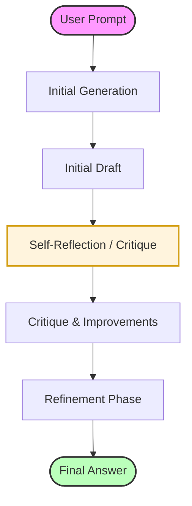
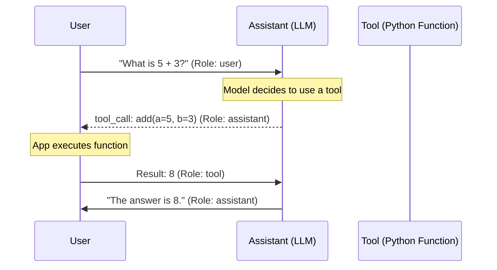
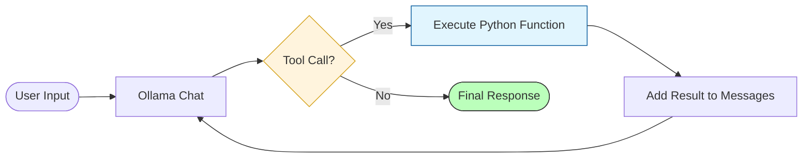

# Simple Agent with Ollama Native Tool Calling

This folder contains examples of how to build AI agents using Ollama's native tool calling capabilities. 


## Prerequisites

- [Ollama](https://ollama.com/) installed and running.
- A model that supports tool calling (e.g., `qwen2.5`, `llama3.1`, `mistral`).
- Python dependencies installed:
  ```bash
  pip install ollama prompt_toolkit
  ```

## Examples

0. **`00_llm_only.py`**: A simple introduction showing how to call the LLM without any tools.
1. **`01_simple_tool.py`**: A basic example showing how to register a single function as a tool.
2. **`02_multiple_tools.py`**: Demonstrates the model's ability to choose the correct tool from a list.
3. **`03_interactive_agent.py`**: A complete loop that handles tool execution and feeds results back to the model for a final answer.
4. **`04_prompt_toolkit_agent.py`**: A polished CLI interface using `prompt_toolkit`.
5. **`05_reflection_agent.py`**: Illustrates the concept of **Reflection** (Generate -> Critique -> Refine).
6. **`06_reflective_tool_agent.py`**: An interactive loop combining **Tool Calling** and **Reflection**.
7. **`07_math_agent_roles.py`**: Demonstrates the different **Conversation Roles** (user, assistant, tool).

### Reflection Workflow



### Agent Roles & Tool Calling Sequence



### Agent Tool Loop (Flowchart)



## How it Works

Ollama's Python library automatically converts your Python functions (using their docstrings and type hints) into the JSON schema required by the model.

```python
import ollama

def my_tool(arg: str) -> str:
    """Description of the tool."""
    return f"Result: {arg}"

response = ollama.chat(
    model='qwen2.5:0.5b',
    messages=[{'role': 'user', 'content': '...'}],
    tools=[my_tool]
)
```

If the model decides to use a tool, `response.message.tool_calls` will contain the necessary information to execute the function.
